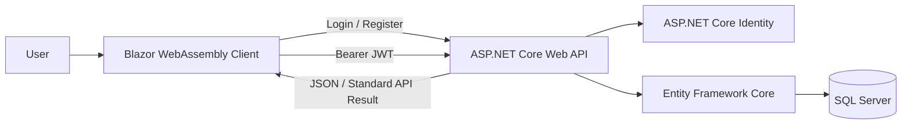

# Blazor JWT Authentication Full-Stack Starter

A full-stack authentication and user-management starter built with **.NET 9**, **ASP.NET Core Web API**, **Blazor WebAssembly**, **ASP.NET Core Identity**, **JWT Bearer Authentication**, **Entity Framework Core**, and **SQL Server**.

The repository is separated into two applications:

- `BlazorBackend/AuthApi` — REST API, authentication, authorization, Identity, database access, API versioning, and Swagger.
- `BlazorFrontend/BlazorFrontend` — Blazor WebAssembly client, login/register flow, protected pages, JWT handling, API integration, and toast notifications.

> This project is currently a starter/demo implementation. Review the security checklist before using it in production.

## Architecture



## Main Features

### Backend

- ASP.NET Core 9 Web API
- ASP.NET Core Identity user storage
- JWT access-token generation and validation
- Login and registration endpoints
- Protected API endpoints using `[Authorize]`
- API versioning under `/api/v1/...`
- SQL Server persistence through Entity Framework Core
- EF Core migrations included
- Swagger/OpenAPI in the Development environment
- Configurable CORS policy for the Blazor client
- Standardized API response wrapper using an action filter
- Basic user-list and user-management scaffolding

### Frontend

- Blazor WebAssembly on .NET 9
- Login and registration pages
- Custom `AuthenticationStateProvider`
- JWT parsing and authentication-state restoration
- Automatic Bearer-token attachment through a `DelegatingHandler`
- Automatic redirect to login after a `401 Unauthorized` response
- Protected routes through `AuthorizeRouteView`
- Browser local-storage integration
- User-list page and edit-page scaffold
- Toast notifications
- PWA/service-worker configuration
- Configurable backend base URL

## Technology Stack

| Layer | Technology |
|---|---|
| Frontend | Blazor WebAssembly, Razor Components, Bootstrap |
| Backend | ASP.NET Core Web API 9 |
| Authentication | ASP.NET Core Identity, JWT Bearer |
| Database | SQL Server |
| Data Access | Entity Framework Core 9 |
| API Documentation | Swagger / OpenAPI |
| API Versioning | Asp.Versioning.Mvc |
| Client Storage | Blazored.LocalStorage |
| Notifications | Blazored.Toast |

## Project Structure

```text
.
├── BlazorBackend/
│   └── AuthApi/
│       ├── Controllers/
│       │   └── v1/
│       ├── Data/
│       ├── DTOs/
│       ├── Framework/
│       ├── Migrations/
│       ├── Models/
│       ├── Services/
│       └── Program.cs
│
└── BlazorFrontend/
    └── BlazorFrontend/
        ├── Auth/
        ├── Layout/
        ├── Models/
        ├── Pages/
        ├── Services/
        ├── wwwroot/
        └── Program.cs
```

## Prerequisites

- .NET 9 SDK
- SQL Server 2019 or later, SQL Server Express, or SQL Server Developer Edition
- Visual Studio 2022 17.12+ or another compatible IDE
- Optional: `dotnet-ef` CLI tool

Install the EF Core CLI tool when required:

```bash
dotnet tool install --global dotnet-ef
```

## Backend Setup

Open the backend directory:

```bash
cd BlazorBackend/AuthApi
```

Store sensitive settings with environment variables or .NET User Secrets. Do not commit real credentials or signing keys.

```bash
dotnet user-secrets init

dotnet user-secrets set "ConnectionStrings:DefaultConnection" "Server=YOUR_SERVER;Database=DotNet9JwtIdentityDb;Trusted_Connection=True;TrustServerCertificate=True;MultipleActiveResultSets=true"
dotnet user-secrets set "Jwt:Key" "REPLACE_WITH_A_LONG_RANDOM_SECRET_KEY"
dotnet user-secrets set "Jwt:Issuer" "AuthApi"
dotnet user-secrets set "Jwt:Audience" "BlazorClient"
dotnet user-secrets set "Jwt:ExpiresInMinutes" "30"
```

Restore packages and apply migrations:

```bash
dotnet restore
dotnet ef database update
```

Run the API:

```bash
dotnet run
```

The current development profile uses:

```text
https://localhost:55281
http://localhost:55282
```

Swagger is available at the API root while the application runs in Development mode.

## Frontend Setup

Open the frontend directory:

```bash
cd BlazorFrontend/BlazorFrontend
```

Set the API address in:

```text
wwwroot/appsettings.Development.json
```

Example:

```json
{
  "ApiBaseUrl": "https://localhost:55281/"
}
```

Restore and run the client:

```bash
dotnet restore
dotnet run
```

The current HTTPS development profile uses:

```text
https://localhost:7140
```

## Main API Endpoints

| Method | Endpoint | Access | Description |
|---|---|---|---|
| POST | `/api/v1/User/Register` | Public | Create a new Identity user and return a JWT |
| POST | `/api/v1/User/Login` | Public | Validate credentials and return a JWT |
| GET | `/api/v1/UserManagement/GetUsers` | Authenticated | Return the current user list |
| PUT | `/api/v1/UserManagement/UpdateUser` | Authenticated | User-update scaffold; implementation is not complete |
| GET | `/api/weather` | Authenticated | Protected sample endpoint |
| GET | `/api/test/public` | Public | Public test endpoint |
| GET | `/api/test/secure` | Authenticated | Protected authentication test endpoint |

## Authentication Flow

1. The user submits an email and password from the Blazor client.
2. The API validates the credentials through ASP.NET Core Identity.
3. The API generates a signed JWT containing user and role claims.
4. The client stores the access token in browser local storage.
5. `JwtAuthorizationMessageHandler` attaches the token to outgoing API requests.
6. Protected API endpoints validate the Bearer token.
7. A `401 Unauthorized` response removes the local token and redirects the user to `/login`.

## Security Checklist Before Production

- Remove database passwords and JWT keys from tracked configuration files.
- Rotate any credential that has already been committed or shared.
- Use environment variables, a secret manager, or .NET User Secrets.
- Restrict CORS to trusted production origins.
- Replace the current one-minute access-token lifetime with an intentional policy.
- Implement refresh tokens or use secure HttpOnly cookies when appropriate.
- Add account lockout, rate limiting, audit logging, and email-confirmation workflows.
- Protect user-management endpoints with an administrator role or policy.
- Validate and implement the `UpdateUser` endpoint before exposing it.
- Remove sample, duplicate, and debug endpoints before deployment.
- Use HTTPS everywhere.
- Add automated tests and CI checks.

## Current Project Status

Implemented:

- Identity-based registration and login
- JWT generation and validation
- Protected API calls
- Client-side authentication-state handling
- User-list retrieval
- API response wrapping
- Swagger and EF Core migrations

In progress / planned:

- Complete user editing
- Role and permission management UI
- Refresh-token flow
- Email verification and password recovery
- Automated tests
- Production-ready logging and monitoring

## Suggested GitHub Topics

```text
dotnet
aspnet-core
blazor-webassembly
jwt-authentication
aspnet-core-identity
entity-framework-core
sql-server
web-api
swagger
pwa
```

## License

Add a license before publishing the repository publicly. MIT is a common choice for open-source starter projects.
